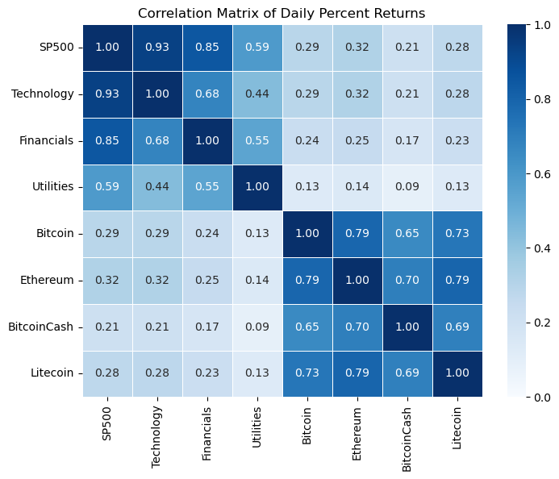
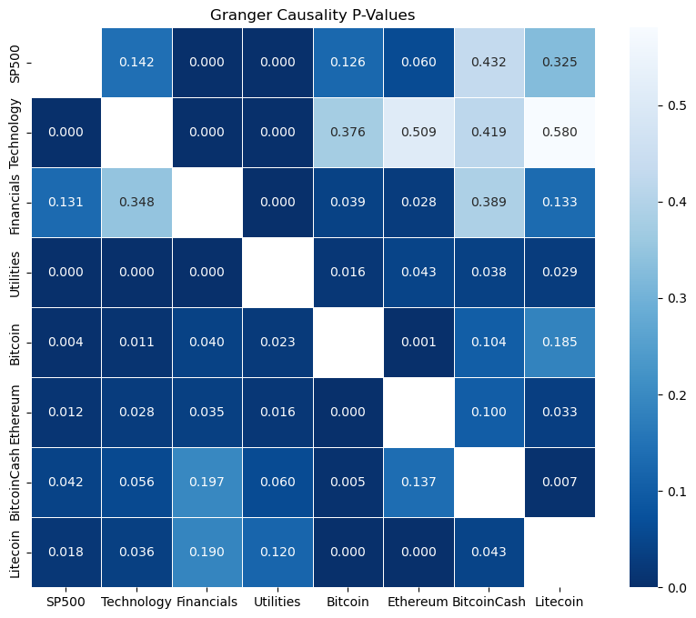

# Cryptocurrency vs Stock Market Time Series Analysis

## Overview

This project analyzes the relationship between cryptocurrency markets and traditional equity markets using statistical modeling and time series analysis. The analysis compares volatility, correlations, predictive relationships, and market behavior between cryptocurrencies and stock sectors.

---

## Objectives

- Compare volatility between cryptocurrencies and stock market sectors
- Analyze relationships between traditional markets and digital assets
- Identify predictive relationships using Granger causality testing
- Examine lagged market interactions using VAR modeling
- Visualize market behavior through rolling volatility and candlestick analysis

---

## Dataset

- Timeframe: 2018 to 2025
- Assets Included:
  - Cryptocurrencies: Bitcoin, Ethereum, Bitcoin Cash, Litecoin
  - Traditional Markets: S&P 500, Technology, Financials, Utilities

The dataset consists of daily market prices and returns used for volatility and predictive time series analysis.

---

## Process

- Cleaned and merged cryptocurrency and stock market datasets
- Calculated daily returns and rolling volatility
- Created correlation heatmaps and volatility visualizations
- Performed Granger causality testing and VAR modeling
- Compared relationships between cryptocurrencies and traditional markets

## Key Findings

- Cryptocurrencies exhibited significantly higher volatility than traditional equity sectors
- Stronger correlations existed within crypto assets and within stock sectors
- Stock market sectors demonstrated predictive influence on cryptocurrency returns
- Ethereum showed stronger interconnectedness with other digital assets
- Market relationships intensified during periods of financial stress

---

## Tools Used

- Python
- pandas
- NumPy
- matplotlib
- seaborn
- statsmodels
- yfinance

---

## Skills Demonstrated

- Time series analysis
- Financial data analysis
- Statistical modeling
- Volatility modeling
- Correlation analysis
- Data visualization
- Predictive modeling

---

## Example Visualizations

### Correlation Matrix of Daily Percent Returns

### Rolling Volatility Comparison

### Granger Causality Heatmap

---

## Conclusion

This project demonstrates how statistical modeling and time series analysis can be used to evaluate relationships between cryptocurrency and traditional financial markets. The results suggest that while cryptocurrencies remain more volatile and partially independent, they still exhibit measurable connections with traditional equity sectors.
