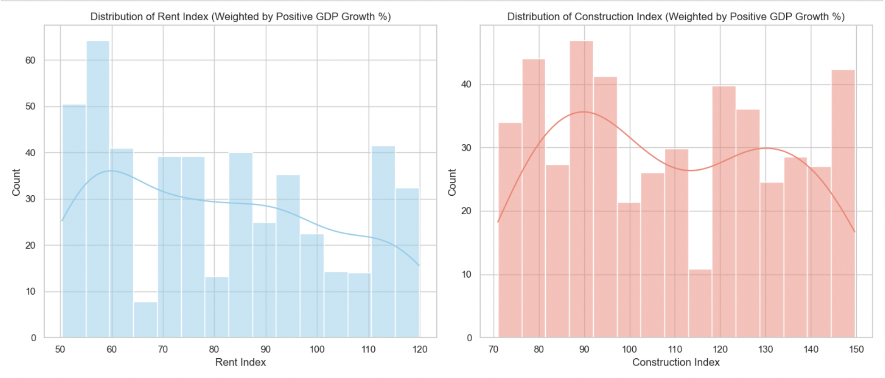

# Housing Market Machine Learning Classification

## Overview
This project analyzes global housing and economic data to understand how GDP growth relates to housing market trends. The goal is to classify economic performance using housing indicators and demonstrate how data can support predictive insights.

---

## Dataset
- **Source:** [Kaggle - Global Housing Market Analysis (2015–2024)](https://www.kaggle.com/datasets/atharvasoundankar/global-housing-market-analysis-2015-2024)
- **Timeframe:** 2015 to 2024
- **Target Variable:** GDP Growth (%)

The dataset includes housing prices, rent indices, construction activity, and other economic indicators across multiple countries.

---

## Key Questions
- How does GDP growth relate to housing prices?
- Which variables best explain economic performance?
- Can housing data be used to classify economic conditions?

---

## Process

### 1. Data Preparation
- Cleaned missing and inconsistent values
- Converted categorical variables using encoding
- Created new features such as GDP to HPI ratio

### 2. Exploratory Analysis
- Compared GDP growth across countries
- Analyzed relationships between housing indicators and economic performance
- Visualized distributions of rent and construction indices

### 3. Feature Engineering
- Created GDP to HPI ratio to capture economic pressure in housing markets
- Improved the model’s ability to detect meaningful economic patterns.

## 4. Modeling
- Used Random Forest Classifier to capture non-linear relationships
- Split data into training and testing sets (80/20)
- Applied cross-validation to improve reliability
- Evaluated performance using classification metrics

---

## Key Findings
- GDP growth shows a positive relationship with housing prices  
- Economic growth occurs across a wide range of housing market conditions  
- GDP to HPI ratio is one of the most influential features  
- Feature engineering improved the model’s ability to detect patterns  

---

## Example Visualization

---

## Tools Used
- Python  
- pandas  
- NumPy  
- seaborn  
- matplotlib  
- scikit-learn  

---

## Skills Demonstrated
- Data cleaning and preprocessing  
- Exploratory data analysis  
- Feature engineering  
- Machine learning classification  
- Model evaluation  

---

## Conclusion
This project shows that housing market indicators can be used to understand and classify economic performance. While growth is not limited to a single type of housing market, certain features provide meaningful signals that improve predictive modeling. This highlights the value of combining economic and housing data for analysis and decision making.

---

## Status
Completed. This project includes data analysis, feature engineering, and machine learning classification.
