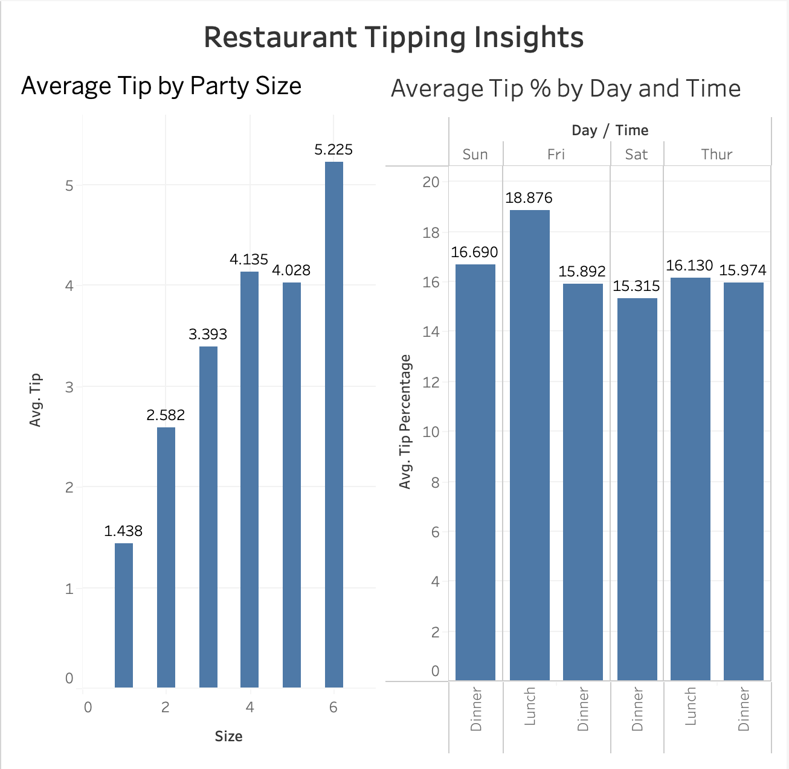

# Restaurant Tipping Behavior Analysis (Python, SQL, Tableau)

## Overview
This project analyzes tipping behavior using restaurant transaction data. The goal is to explore relationships between bill amount, tip amount, and dining conditions.

## Objectives
- Explore tipping patterns
- Identify relationships between bill size and tip size
- Visualize trends in tipping behavior

## SQL Analysis Summary

Additional SQL validation and exploratory analysis were completed in DBeaver using SQLite. All SQL scripts are organized in the `/sql` folder.

## Key Findings
- Average tip amount increases with party size, driven by larger total bills
- Tip percentage decreases as party size increases, indicating lower proportional tipping in larger groups
- Sunday dinner produces the highest average dollar tips
- Friday lunch yields the highest average tip percentage
- Higher dinner tips are primarily explained by larger bill sizes rather than increased generosity

## Explanation of Findings

The results suggest that tipping behavior is influenced by both group size and dining context. Larger parties generate higher total tips due to increased bill amounts, but tend to tip a lower percentage overall. This may reflect shared responsibility or social dynamics within larger groups.

Time-based trends show that lunch customers tend to tip a higher percentage, while dinner generates higher total tips due to larger bills. These patterns highlight how both spending behavior and context impact tipping outcomes.

## Tableau Dashboard

### Example SQL Output: Tip Percentage by Party Size

| Party Size | Avg Tip % |
|---|---:|
| 1 | 21.73 |
| 2 | 16.57 |
| 3 | 15.22 |
| 4 | 14.59 |
| 5 | 14.15 |
| 6 | 15.62 |

### Example SQL Output: Tip Percentage by Day and Time

| Day | Time | Avg Tip % |
|---|---|---:|
| Fri | Lunch | 18.88 |
| Sun | Dinner | 16.69 |
| Thur | Lunch | 16.13 |
| Thur | Dinner | 15.97 |
| Fri | Dinner | 15.89 |
| Sat | Dinner | 15.32 |

### SQL Skills Demonstrated
- SELECT
- GROUP BY
- ORDER BY
- AVG()
- ROUND()
- multi-column grouping
- percentage analysis

  
## Tools Used
- Python
- pandas
- matplotlib
- seaborn
- SQL
- DBeaver
- SQLite

## Status
Completed analysis using Python for exploratory data analysis and SQL validation in DBeaver. Additional Tableau visualizations may be added in future updates.
